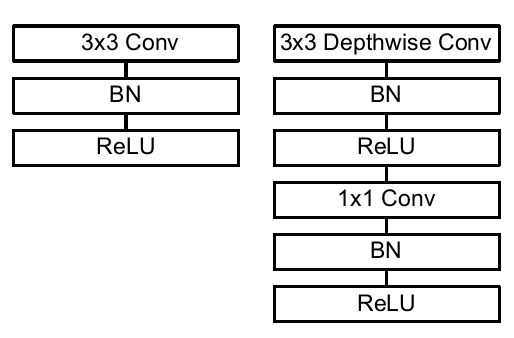
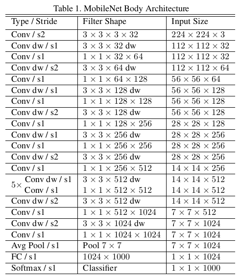
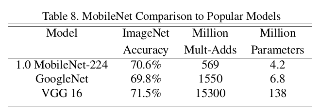
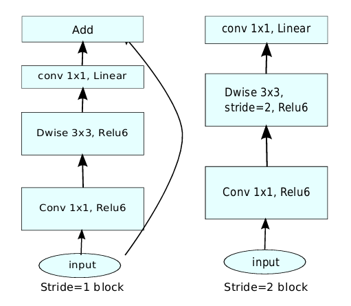
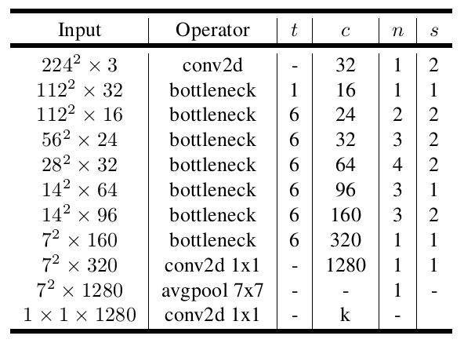

# mobilenet

mobilenet是google提出的轻量级模型，在2017年ImageNet比赛中取得了冠军。

MobileNet v1就是将常规卷积替换为深度可分离卷积的VGG网络。

什么是深度可分离卷积呢？

深度可分离卷积是在1×1卷积基础上的一种创新。主要包括两个部分：深度卷积和1*1卷积。深度卷积的目的在于对输入的每一个通道都单独使用一个卷积核对其进行卷积，也就是通道分离后再组合。1*1卷积的目的则在于加强深度。

MobileNet v1完整网络结构如下图所示。

MobileNet v1的特色就是深度可分离卷积，但研究人员发现深度可分离卷积中有大量卷积核为0，即有很多卷积核没有参与实际计算。是什么原因造成的呢？v2的作者发现是ReLU激活函数的问题，认为ReLU这个激活函数，在低维空间运算中会损失很多信息，而在高维空间中会保留较多有用信息。
既然如此，v2的解决方案也很简单，就是直接将ReLU6激活换成线性激活函数，当然也不是全都换，只是将最后一层的ReLU换成线性函数。具体到v2网络中就是将最后的Point-Wise卷积的ReLU6都换成线性函数。v2给这个操作命名为linear bottleneck，这也是v2网络的第一个关键点。

MobileNet v3同样是由谷歌于于2019年提出新版本的MobileNet。在v2网络的基础上，v3提出了四个大的改进措施。

- 使用NAS神经架构搜索确定网络结构

- 在v2的block基础上引入**Squeeze and Excitation结构**

- 使用h-swish激活函数

- 对v2网络尾部结构进行改进
  
